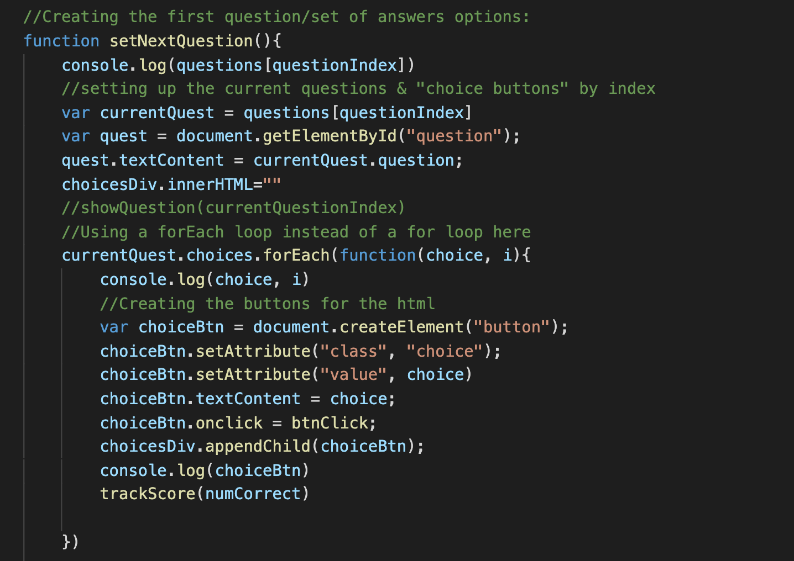
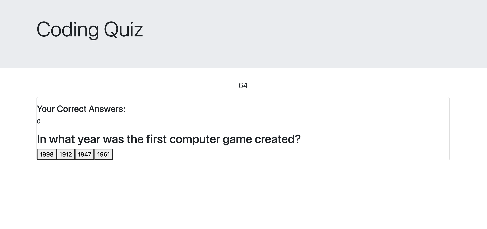

Meredith Jones: Javascript Coding Quiz
==================================================
This project was by far the most challening coding task that I have embarked on to date. 

The function was to be a quiz which would time participents, track their score, as well as deduct five seconds from the timer for incorrect answers.

I created 5 multiple choice answers on the subject of coding. I enjoyed creating the content of the questions. 

It was the first time that I used Javascript to manipulate the DOM in order to create content and elements in the html dynamically. 
It was also my first time using a "For Each" loop rather that the for loop that I have used in the past. An image of that function is included below for reference. 

I was focused almost entierly on the function of the page, so the styling defintiely leaves something to be desired as you will see in the screenshot below. 

In an ideal world, I would certainly be presenting something with a more dynamic appearance. 

Although the function of the quiz is fairly simple, I found all of the layers to create it to be extremely complex. I devoted many hours of work to creating the quiz, but sadly was unable to add many functions before my time to work on the project ran out. 

I was happy to be able to get a countdown functioning, as well as increasing and storing the user score. Both of those functions presneted me with many hours of struggle to get them working.

I know that this is far from my best work, but it reprents a lot of hard work. I can say for sure that I have learned a lot in the process of creating the quiz. 